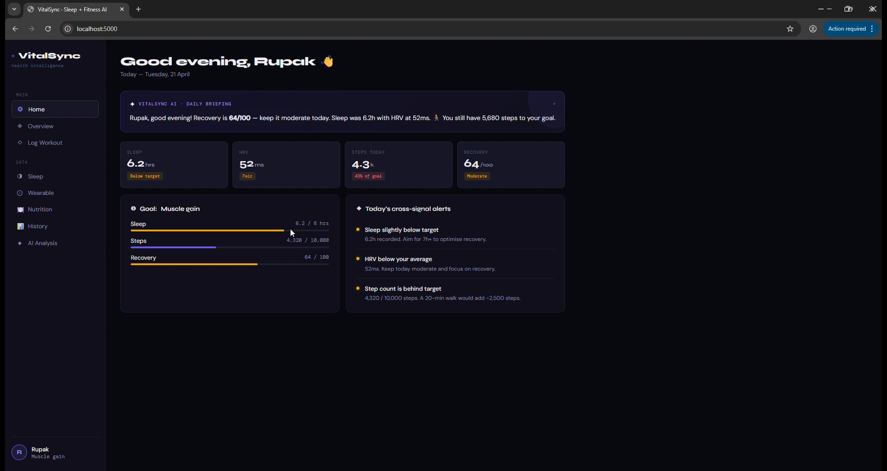

# VitalSync — TeleRehab AI Dashboard

> **AI-powered rehabilitation & fitness tracking dashboard** — upload a workout video, let MediaPipe detect your body landmarks, and get instant per-rep biomechanical analysis, form scoring, calorie estimates, and personalised recommendations.

---

## ✨ Key Features

| Feature | Details |
|---|---|
| 🎥 **Video-based exercise analysis** | Upload `.mp4 / .mov / .avi / .mkv` — the backend detects exercise type automatically |
| 🦴 **Pose detection** | Google MediaPipe Pose Landmarker (33 key-points, full-body model) |
| 🏋️ **6 exercises supported** | Squat · Push-Up · Lunge · Bicep Curl · Shoulder Press · Deadlift |
| 📊 **Per-rep metrics** | Form score, ROM, Tempo, Stability, Depth, Symmetry gap, Torso lean |
| 🔥 **Calorie estimation** | MET-based formula using user weight & session duration |
| 📄 **PDF report** | Auto-generated report saved in `output/<session>/` |
| 💤 **Sleep & wearable dashboard** | Syncs live from a REST API or falls back to built-in mock data |
| 🍽️ **Nutrition tracker** | Log meals, track macros vs daily targets, weekly calorie chart |
| 🤖 **AI analysis page** | Claude-powered cross-signal health summary (sleep + workout + wearable + nutrition) |

---

## 🎬 Demo Video

See the full dashboard in action — live pose detection, rep counting, form scoring, and the complete UI walkthrough:

👉 **[Watch the Demo on Google Drive](https://drive.google.com/drive/folders/1wSZbogHCnsYMsU7Uaqv44FOLYGcomPX_?usp=sharing)**

> The demo shows: onboarding flow · wearable data sync · AI video analysis with MediaPipe · per-rep breakdown · sleep & nutrition tracking · AI Analysis page.

---

## 🗂 Project Structure

```
Dashboardd/
├── vitalsync.html              # Main single-page dashboard (open in browser)
├── wearable_mock.json          # Mock wearable / sleep data (Apple Watch format)
│
└── TeleRehab_Project/          # Python backend
    ├── server.py               # Flask API server  ← START HERE
    ├── app.py                  # Full ML pipeline (MediaPipe + analysis engine)
    ├── config.py               # User & exercise threshold constants
    ├── requirements.txt        # Python dependencies
    │
    ├── models/
    │   └── pose_landmarker_full.task   # MediaPipe model file (~9 MB)
    │
    ├── videos/                 # Uploaded videos land here (auto-created)
    ├── output/                 # Per-session analysis output (auto-created)
    │   └── <session_id>/
    │       ├── *_reps.json     # Per-rep data
    │       ├── *_summary.json  # Session summary
    │       ├── *.csv           # Rep-level CSV export
    │       └── *.pdf           # PDF report
    │
    └── utils/                  # Helper modules
        ├── angles.py           # Joint angle utilities
        ├── drawing.py          # OpenCV overlay helpers
        ├── exercises.py        # Exercise-type constants
        └── feedback.py         # Feedback string helpers
```

---

## ⚙️ Tech Stack

| Layer | Technology | Purpose |
|---|---|---|
| **Frontend** | HTML5 · Vanilla CSS · Vanilla JS | Single-file SPA (`vitalsync.html`) |
| **Charts** | Chart.js 4.4 (CDN) | Sleep trend, step bars, calorie history |
| **Typography** | Google Fonts — *Syne*, *DM Sans*, *DM Mono* | Premium dark-mode UI |
| **Backend API** | Flask 3 (Python) | REST endpoints: `/api/analyze`, `/api/status` |
| **Pose detection** | MediaPipe Tasks API 0.10+ | 33-landmark body tracking from video frames |
| **Computer vision** | OpenCV (`cv2`) | Video decoding, frame iteration, overlay drawing |
| **PDF generation** | ReportLab | Per-session PDF analysis report |
| **Plotting** | Matplotlib | Form-score and rep-count line charts |
| **AI analysis** | Claude API (streamed) | Cross-signal health summary on the AI Analysis page |

---

## 🚀 Running Locally (Step-by-Step)

### Prerequisites

- **Python 3.10 – 3.12** (MediaPipe does **not** support Python 3.13 yet)
- **Git** (to clone)
- A modern browser (Chrome / Edge / Firefox)

---

### Step 1 — Clone the repository

```bash
git clone https://github.com/<YOUR_USERNAME>/<YOUR_REPO_NAME>.git
cd <YOUR_REPO_NAME>
```

---

### Step 2 — Create and activate a virtual environment

```bash
# Windows (PowerShell)
python -m venv venv
.\venv\Scripts\Activate.ps1

# macOS / Linux
python3 -m venv venv
source venv/bin/activate
```

> **Tip:** If PowerShell blocks script execution on Windows, run:
> `Set-ExecutionPolicy -ExecutionPolicy RemoteSigned -Scope CurrentUser`

---

### Step 3 — Install dependencies

```bash
cd TeleRehab_Project
pip install -r requirements.txt
```

> ⚠️ **MediaPipe note:** Make sure you're on **Python 3.10–3.12**.
> If you see a `mediapipe` install error, try `pip install mediapipe==0.10.9`.

---

### Step 4 — Verify the MediaPipe model is present

The file `TeleRehab_Project/models/pose_landmarker_full.task` (~9 MB) must exist.

If it's missing (e.g., was excluded from git due to size), download it manually:

```bash
# From inside TeleRehab_Project/
mkdir -p models
curl -L https://storage.googleapis.com/mediapipe-models/pose_landmarker/pose_landmarker_full/float16/latest/pose_landmarker_full.task \
     -o models/pose_landmarker_full.task
```

Or download via browser:  
👉 https://storage.googleapis.com/mediapipe-models/pose_landmarker/pose_landmarker_full/float16/latest/pose_landmarker_full.task

---

### Step 5 — Start the Flask server

Make sure you're inside `TeleRehab_Project/`:

```bash
python server.py
```

You should see:

```
============================================================
  VitalSync - TeleRehab API Server
  Serving dashboard from: ...Dashboardd/
  Videos saved to:        ...TeleRehab_Project/videos
  Output written to:      ...TeleRehab_Project/output
============================================================
  -> Open http://localhost:5000 in your browser
============================================================
```

---

### Step 6 — Open the dashboard

Navigate to **http://localhost:5000** in your browser.

1. Complete the **4-step onboarding** (name, goals, device, launch).
2. Explore the sidebar: **Home → Overview → Log Workout → Sleep → Wearable → Nutrition → History → AI Analysis**.

---

### Step 7 — Analyse a workout video

1. Go to **Log Workout** in the sidebar.
2. Click **"AI video analysis"**.
3. Drop or browse for a workout video (MP4 / MOV / AVI, up to 500 MB).
4. Wait for the ML pipeline to run (~10–60 s depending on video length).
5. View the per-rep breakdown, form score, calorie estimate, and any warnings.
6. Click **"Save this ML-analysed workout"** to persist it to history.

---

## 🔧 Configuration

Edit `TeleRehab_Project/config.py` or the constants at the top of `app.py` to customise behaviour:

| Constant | Default | Description |
|---|---|---|
| `USER_NAME` | `"Participant 1"` | Display name (overridden per-request via form field) |
| `USER_WEIGHT_KG` | `70` | Used for calorie calculation |
| `USER_HEIGHT_M` | `1.70` | Used for BMI calculation |
| `GOAL_MODE` | `"fitness"` | `"rehab"` / `"beginner"` / `"fitness"` — shapes rep recommendations |
| `MAX_VIDEO_SIZE_MB` | `100` | Hard limit on uploaded video size (server-side check) |
| `SQUAT_DOWN_THRESHOLD` | `125°` | Knee angle that counts as the bottom of a squat rep |
| `SYMMETRY_WARNING_DEG` | `15°` | Left-right angle gap that triggers a symmetry warning |
| `TORSO_LEAN_WARNING_DEG` | `40°` | Torso angle that triggers an excessive-lean warning |

---

## 🌐 API Reference

The Flask server exposes three endpoints:

### `GET /`
Serves `vitalsync.html` — the full dashboard UI.

### `GET /api/status`
Health check. Returns:
```json
{ "status": "ok", "engine": "TeleRehab MediaPipe" }
```

### `POST /api/analyze`
Accepts a multipart form upload and returns full JSON analysis.

**Form fields:**

| Field | Type | Default | Description |
|---|---|---|---|
| `video` | file | **required** | The workout video (.mp4, .mov, .avi, .mkv) |
| `weight_kg` | float | 70 | User weight for calorie & BMI calculation |
| `height_m` | float | 1.70 | User height for BMI calculation |
| `age` | int | 25 | User age |
| `goal_mode` | string | "fitness" | `"rehab"` / `"beginner"` / `"fitness"` |
| `user_name` | string | "Participant 1" | Name shown in the PDF report |

**Response (JSON) — key fields:**

```json
{
  "success": true,
  "processing_time_sec": 14.3,
  "workoutType": "Squat",
  "totalReps": 12,
  "correctReps": 10,
  "incorrectReps": 2,
  "formScoreAvg": 78.4,
  "caloriesEstimate": 45.2,
  "riskFlag": "Low Risk",
  "overallRating": "Good",
  "reps": [ ... ],
  "summary": { ... }
}
```

---

## 📋 Output Files

Each video analysis creates a folder at `TeleRehab_Project/output/<timestamp_uuid>/`:

| File | Description |
|---|---|
| `*_summary.json` | Full `SessionSummary` dataclass as JSON |
| `*_reps.json` | Array of `RepRecord` objects (one per detected rep) |
| `*_reps.csv` | Same data as CSV for spreadsheet analysis |
| `*_form_score.png` | Line plot of per-rep form scores |
| `*_report.pdf` | Printable PDF report (ReportLab) |
| `*_annotated.mp4` | Video with pose skeleton + live dashboard overlay |

---

## 🧩 How the ML Pipeline Works

```
Upload video
     │
     ▼
Frame extraction (OpenCV)
     │
     ▼
MediaPipe Pose Landmarker (33 key-points per frame)
     │
     ▼
Feature extraction per frame
  ├─ Joint angles  (knee, elbow, hip)
  ├─ Torso lean angle
  ├─ Left-right symmetry gap
  └─ Wrist / shoulder Y position
     │
     ▼
Exercise detection (majority-vote over sliding windows)
  Squat / Push-Up / Lunge / Bicep Curl / Shoulder Press / Deadlift
     │
     ▼
Rep counting (finite-state machine: UP → DOWN → UP)
     │
     ▼
Per-rep scoring
  ├─ ROM score    (range of motion)
  ├─ Tempo score  (rep duration)
  └─ Stability score (symmetry + torso)
  → weighted → Form score (0–100)
     │
     ▼
Session summary
  ├─ Calorie estimate (MET × weight × time)
  ├─ BMI + category
  ├─ Consistency score
  ├─ Risk flag (Low / Moderate / High)
  └─ Goal-mode recommendation
     │
     ▼
Output (JSON + CSV + PDF + annotated video)
```

---

## 🛠 Troubleshooting

| Problem | Fix |
|---|---|
| `mediapipe` install fails | Use Python 3.10–3.12. Avoid Python 3.13. |
| `pose_landmarker_full.task` not found | Download it (see Step 4 above) |
| `flask` not found | Run `pip install flask` inside your venv |
| Video upload returns 500 | Check the Flask console for the traceback; ensure OpenCV can read the codec |
| Port 5000 already in use | Change the port in `server.py` last line: `flask_app.run(port=5001)` |
| AI Analysis page shows no text | The Claude API call requires a valid API key; the rest of the app works without it |
| Windows PowerShell script error | Run `Set-ExecutionPolicy RemoteSigned -Scope CurrentUser` before activating venv |

---

## 📸 Screenshots

**Dashboard Home — wearable sync, sleep metrics, AI daily briefing:**



---

## 🤝 Contributing

1. Fork the repo
2. Create a feature branch: `git checkout -b feature/my-feature`
3. Commit your changes: `git commit -m "feat: add my feature"`
4. Push: `git push origin feature/my-feature`
5. Open a Pull Request

---

## 📄 License

This project was built as an academic cornerstone project. Feel free to use and adapt it with attribution.

---

## 👤 Author

Rupak Jana & Hrithik Sharma
